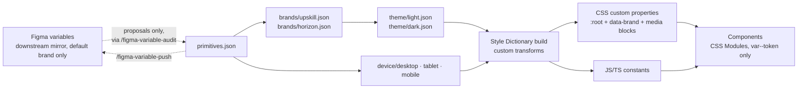

---
sources:
  - packages/tokens/src/**
  - packages/tokens/build.js
  - docs/decisions/002-three-layer-token-model.md
  - docs/decisions/003-root-token-convention.md
  - docs/decisions/004-layout-token-categories.md
  - docs/decisions/005-size-vs-space-primitives.md
  - docs/decisions/012-brand-layer-multi-brand.md
  - docs/decisions/014-feedback-hue-and-ramp-regeneration.md
  - .claude/commands/tokens-author.md
# clock reset 2026-07-10: /tokens-author adds contrast-check + usage/sense refresh to its procedure; pipeline description unchanged, still accurate
---
# Token pipeline

## What it is

Design [tokens](08-glossary.md) are the system's single source of design decisions — colors, spacing, typography, radii. They are authored as W3C DTCG JSON in `packages/tokens/src/` and resolved through a fixed four-layer model. A [Style Dictionary](08-glossary.md) build then turns them into the [CSS custom properties](08-glossary.md) and JS/TS constants that components actually consume. Figma holds a mirror of these tokens as variables, but the committed JSON is the source of truth ([ADR-002](decisions/002-three-layer-token-model.md), 2026-06-17 amendment).

## Why it's built this way

### Four layers, not one flat file

[ADR-002](decisions/002-three-layer-token-model.md) records the forcing constraints: a flat token file cannot simultaneously (1) hold raw exported values cleanly, (2) let the same semantic name resolve differently in light and dark mode, and (3) let spacing/typography differ per breakpoint. A two-layer model (primitives + semantic) handles color modes but "conflates responsive layout decisions with colour semantics." So the model was originally three ordered layers; a fourth — brand — was inserted between primitives and theme once the system needed to support more than one brand identity ([ADR-012](decisions/012-brand-layer-multi-brand.md), 2026-07-06). Later layers override earlier ones, and aliases may only point to earlier layers:

| Layer | Files | Responsibility |
|---|---|---|
| **Primitives** | `primitives.json` | Raw, context-free values. Single source of truth. Hand-edited via PR. |
| **Brand** | `brands/<brand>.json` (`upskill`, `horizon`) | Per-brand color ramp mappings (`brand`/`accent`/`neutral`/`surface` slots), `font.family.*`, and literal `border-radius.*`. |
| **Theme** | `theme/light.json`, `theme/dark.json` | Brand-agnostic semantic color aliases — maps intent (`color.background.brand`) to a brand slot or functional primitive. Switching theme files switches the entire color mode; switching a `data-brand` attribute switches the brand, independently.  |
| **Device** | `device/desktop.json`, `device/tablet.json`, `device/mobile.json` | Responsive spacing, grid, typography per breakpoint. Desktop ≥ 1440px, tablet ≥ 768px, mobile < 768px. |

### Code is the source of truth — a reversal forced by plan limits

ADR-002 originally declared primitives Figma-owned ("never hand-edited"). The 2026-06-17 amendment reversed this, and the reason is worth stating plainly because it shapes everything downstream: **automated Figma→code sync is impossible on the available plan.** The Figma Variables REST API is Enterprise-only, Code Connect is Org/Enterprise-only, and Token Studio's free GitHub sync is single-file while this architecture is deliberately six files (primitives + two theme + three device). The only automatable direction is code→Figma, interactively via the Figma plugin/MCP. Consequences:

- `primitives.json` is hand-editable via PR, like every other layer.
- A value invented in Figma is a *proposal* until it lands in `primitives.json`.
- `/figma-variable-audit` was retargeted from an import gate to a drift/reconciliation check, and `/figma-variable-push` writes code-side tokens into Figma when code is ahead.

### Representational divergence is not drift

The second ADR-002 amendment (2026-06-22) covers a subtler case: Figma cannot store **unitless values**. Line-heights are authored in code as unitless ratios (`1`, `1.25`, `1.4`, `1.5`, `1.75`) so they adapt to any font size; Figma must hold them as fixed px values. This permanent difference is an accepted *representational divergence*, not drift: both Figma moments exclude it from their diffs, `figma-variables.json` tags or omits it, and Figma's fixed value never flows back into `primitives.json`.

### One brand, then two

For its first phase this was a single-brand system — theme files referenced primitive ramps directly (`{color.terracotta.9}`), so a second brand would have meant forking every theme file. [ADR-012](decisions/012-brand-layer-multi-brand.md) inserted the brand layer instead: theme files now reference brand slots (`{color.brand.9}`), and a brand file maps those slots to whichever hue it wants. `upskill` (the default) maps `brand → terracotta`, `accent → teal`, `neutral → sand`, `surface → gold`; the second brand, `horizon`, maps `brand → cyan`, `accent → amber`, `neutral`/`surface → grey`, with Playfair Display headlines and sharper radii. Runtime selection is a `data-brand` attribute, mirroring `data-theme`.

Two rules keep this tractable for a one-maintainer system: **a brand slot needs a full light + dark ramp** (a ramp is the glossary's [Scale](08-glossary.md) — a hue's numbered 1–12 lightness sequence; this rules out hues authored with only one, historically `cyan` — since patched to qualify, see below), and **brands swap hues, not steps** — a shared semantic like `border.selected` always sits at the same ramp step across every brand, so a brand that fails contrast at that step gets a different hue mapping or a tracked waiver, never a per-brand override of the shared step.

### Naming decisions with teeth

Three further ADRs pin down naming so token names encode *intent*, not just numbers:

- **[ADR-003](decisions/003-root-token-convention.md)** (superseded 2026-06-14) — the group-default naming debate. `$root` was originally chosen, then fully reversed to `.default` once research confirmed the W3C DTCG community and tooling ecosystem (Tokens Studio, Style Dictionary) converge on `.default`; `$root` required a custom preprocessor and produced meaningless `-root` suffixes in CSS output. The ADR is kept with a supersession note rather than deleted — see [Governance](05-governance.md) for why that matters.
- **[ADR-004](decisions/004-layout-token-categories.md)** — `space.*` answers "how much space goes here *inside a component*?" (inset/stack/inline, the Nathan Curtis spacing model — inset is padding inside an element, stack is vertical gaps between stacked elements, inline is horizontal gaps in a row); `grid.*` answers "how is the *page grid* structured at this breakpoint?" (margin/gutter/columns/screen-size) and is consumed by exactly one place, the `.container` utility class. Cross-use is forbidden even when the pixel values coincide.
- **[ADR-005](decisions/005-size-vs-space-primitives.md)** — `space.*` is for empty space (gap, padding, margin); `size.*` is for filled elements (icon, avatar, control dimensions). Same 4px base unit, different intent: `size.300 = 24px` and `space.300 = 24px` are the same raw value describing different things. T-shirt names (`sm`/`md`/`lg`) live only at the semantic layer, mapped per component — `icon.size.sm` and `avatar.size.sm` are both "small" but resolve to different primitives.

## How it works, concretely

Every token carries `$type` and `$value`. Concrete values and aliases look like this (real shapes from `packages/tokens/src/`):

```json
{ "$type": "color", "$value": "#D15D50" }
{ "$type": "color", "$value": "{color.terracotta.9}" }
```

No `$extensions` blocks are ever committed — they are stripped when reconciling anything brought over from Figma. Each color hue (`terracotta`, `cyan`, `gold`, `teal`, `sand`, `grey`, `black`, `white`, `amber`, `red`) has three sub-scales that must never be mixed on one token: `1–12` (light mode), `dark-1`–`dark-12` (dark mode), `alpha-1`–`alpha-12` (transparent variants). `cyan` originally shipped without a dark ramp; its light ramp was replaced and a dark ramp added (2026-07-06, a custom Radix-generated scale) specifically so it could qualify as a brand hue — every other hue's ramp is original. The newest hue, `red` (2026-07-07, the official Radix red scale, light + dark ramps), exists for one reason: `feedback.error` needed a dedicated hue that is deliberately **not** brand-eligible, so an error state can never visually collide with a brand's accent (ADR-002 amendment; the full rationale, including the ramp-regeneration method, is [ADR-014](decisions/014-feedback-hue-and-ramp-regeneration.md)).

`npm run tokens:build` runs Style Dictionary with the custom transforms defined in `packages/tokens/build.js`: px→rem, font-weight string→numeric, the (historical) `$root` rename, and a media-query combiner. Brand files build to `brand.<brand>.css`, and theme files build with `outputReferences: true` so every theme token emits as a `var()` chain against brand slots rather than a resolved value — one `theme.<mode>.css` serves every brand ([ADR-012](decisions/012-brand-layer-multi-brand.md)). The device-layer output strategy comes straight from ADR-002: desktop tokens emit to `:root` as the baseline, tablet and mobile override *the same custom property names* inside `@media` blocks — one CSS file, no per-breakpoint imports:

```css
:root {
  --font-size-body-default: 16px;
  --space-stack-md: 16px;
}
@media (max-width: 1439px) {   /* tablet */
  :root { --font-size-body-default: 15px; --space-stack-md: 12px; }
}
```

**The invariant that holds it together:** components only ever consume the built output (`var(--token-name)` in CSS Modules, constants in TS) — never the source JSON. The authoring procedure, including when a transform change needs an ADR, lives in the `/tokens-author` command (`.claude/commands/tokens-author.md`).

## Diagram



## Related

- ADRs: [002 — Three-layer token model](decisions/002-three-layer-token-model.md) (+ two amendments), [003 — `$root` convention (superseded)](decisions/003-root-token-convention.md), [004 — `space.*` vs `grid.*`](decisions/004-layout-token-categories.md), [005 — `size` vs `space`](decisions/005-size-vs-space-primitives.md), [012 — Brand layer](decisions/012-brand-layer-multi-brand.md)
- Commands: `/tokens-author`, `/figma-variable-audit`, `/figma-variable-push` (all in `.claude/commands/`)
- Config: `packages/tokens/build.js` · Scripts: `npm run tokens:build`, `npm run tokens:usage`, `npm run tokens:contrast-check` — see the [npm scripts reference](07-npm-scripts-reference.md)
