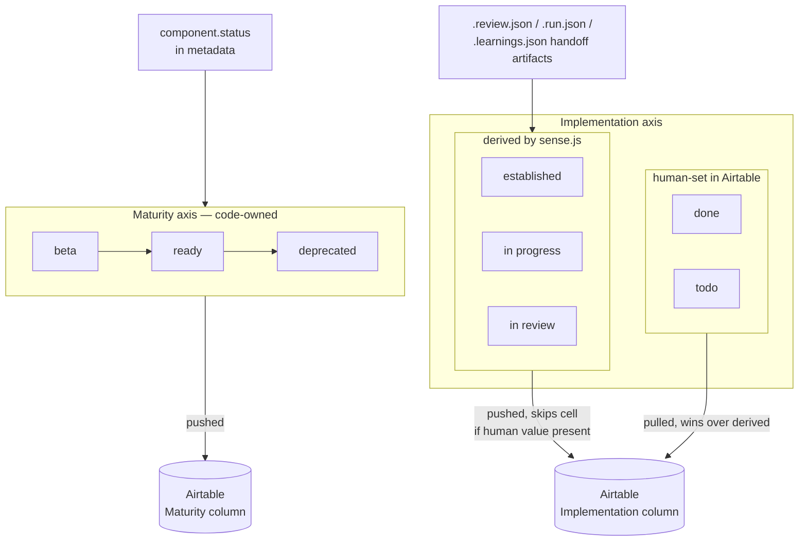

---
sources:
  - packages/components/component.schema.json
  - scripts/validate-metadata.js
  - scripts/sense.js
  - scripts/lib.js
  - docs/decisions/001-component-metadata-schema.md
  - docs/decisions/006-carousel-hook-not-component.md
  - docs/decisions/009-extend-vs-new-vs-internal.md
  - docs/decisions/010-component-lifecycle-two-axes.md
---
# Component lifecycle

## What it is

Every component in `packages/components/src/` ships four co-located files — `index.tsx`, a CSS Module (a stylesheet scoped to just that component), a stories file (its Storybook examples), and `ComponentName.metadata.json` — and moves through a lifecycle tracked on **two independent axes**: maturity (is it production-ready?) and implementation (where is it in the build-review-learn pipeline?). The metadata file is the machine-readable contract that the agentic tooling reads; the two-axis lifecycle is how code-derived state and human sign-off coexist without overwriting each other.

## Why it's built this way

### Metadata as JSON, validated against a schema

[ADR-001](decisions/001-component-metadata-schema.md) records the format decision. Agentic moments like `/component-scaffold` and `/layout-generation` need structured per-component context — purpose, constraints, anti-patterns, relationships — and without a shared schema "each component would accumulate ad-hoc documentation in inconsistent shapes." JSON won over Markdown on evidence: research by Indeed (Diana Wolosin, Into Design Systems 2025) benchmarked 8 MCP configurations across 1,056 prompts and found JSON reduced token cost by ~80% with equal or better accuracy — "JSON is unambiguous: explicit keys, explicit values, no parsing required."

The schema was synthesized from three sources (giorris.dev's `usage`/`variants`/`antiPatterns` base, hvpandya.com's `tokens` list, the LLM Component Schema Standard's `generativeRules`) and deliberately *excludes* some of what those sources include: `anatomy` lives in Storybook instead; `aiHints`/`generativeRules` were distributed into `usage.keywords`, `usage.when`, and composition/layout fields rather than kept as a monolithic block.

The 2026-06-17 amendment tightened it after a foundation review found 7 of 11 metadata files failed the schema: `variants` became a map of **named axes** (each axis holding `{ options, default, purpose }`), one taxonomy was enforced (`component.category` ∈ `atom|molecule|organism|layout`, `component.type` ∈ `interactive|display|container|input`), and validation moved into CI (`scripts/validate-metadata.js`, ajv — the JSON-schema validator library — draft 2020-12, run in `components-check.yml`).

### Two axes, because one field kept lying

[ADR-010](decisions/010-component-lifecycle-two-axes.md) starts from a concrete symptom: the Airtable Components table had a single `Status` field mixing production-readiness (`beta`/`ready`/`deprecated`) with pipeline progress (`todo`/`in progress`/`in review`). A component that had completed a full adversarial review still showed only `ready`; `Accordion` was `beta` in maturity yet its implementation was finished — one field cannot express both facts. The decision: two axes, each owned by the right process and flowing in the right direction.

| Value | Axis | Owner | Set where |
|---|---|---|---|
| `beta` / `ready` / `deprecated` | Maturity | Code | `component.status` in metadata → pushed to Airtable's `Maturity` column |
| `in progress` / `in review` / `established` | Implementation | Code (derived) | `sense.js` derives from handoff artifacts → pushed to `Implementation` |
| `done` / `todo` | Implementation | **Human** | Set directly in Airtable, pulled into `.claude/component-signoff.json`, never overwritten |

The derivation rules are machine-checkable. `in review` = the loop is closed, which happens two ways. On the full path, `.review.json` **and** `.learnings.json` are both present. On the lighter path, a `.review.json` carrying `"path": "lighter"` closes the loop on its own — it's written by `/code-review`, the quicker review run inside the working session itself with no fresh reviewer [subagent](08-glossary.md), and that route has no separate learnings step. `in progress` = a full-path `.review.json` awaiting its learnings back-fill, or — rarer, usually a tooling gap — a `.run.json` with no matching review. `established` = no loop artifacts (a lone `.snapshot.json` is just a context cache — the component predates the loop). Each component's entry in `.claude/component-pipeline.json` also records which route it took in a `reviewPath` field (`full`/`lighter`). Human `done`/`todo` values win over the derived stage, and the push **never overwrites them** — the "don't downgrade done" guard, covered in [Governance](05-governance.md). Because the two axes never share a column, a pushed value and a human value can never collide: `Accordion` reads `Maturity: beta` + `Implementation: done` simultaneously.

### The three-question test before any new component

[ADR-009](decisions/009-extend-vs-new-vs-internal.md) is the anti-proliferation rule, applied in order:

1. **Same semantic role** (same role, interaction model, visual family; differs only in a containable presentational detail) → **extend** the existing component with a prop or variant. *Example: `trailingIcon` on Button — the ghost variant already carried the action semantics; icon placement is presentational.*
2. **Different semantic role despite similar shape** (different chrome at rest, different icon axis, different state model, different ARIA role or keyboard contract) → **new component**. *Example: `ButtonArrow` (navigation — bordered, `disabled` state, left/right) vs the Accordion disclosure trigger (borderless at rest, `open/collapsed`, up/down). Per the ADR: "they share a circular shape but nothing else load-bearing."*
3. **Single parent, no other consumer in the fixed set** → **molecule-internal styled element** in the parent's CSS Module, not extracted to `src/components/`. *Example: the Accordion expand trigger — internal to Accordion "the same way `<summary>` is internal to `<details>`."* The signal: you cannot name a second consumer without inventing a hypothetical.

Visual similarity alone is never a reason to create a new component or to merge two that differ in role.

### The carousel precedent: sometimes the answer is a hook

[ADR-006](decisions/006-carousel-hook-not-component.md) is the same don't-over-build spirit applied a level up. The Homepage needed a horizontal card carousel; the options were a full `Carousel` component, a hook + documented pattern, or nothing. Prior art split cleanly: Polaris, Atlassian, Radix, and Chakra ship *no* carousel component (primitives + pattern); Carbon, Ant, and Bootstrap ship one but are full product frameworks that accept the maintenance cost; shadcn/ui wraps Embla. The decision: `useCarousel(itemCount, visibleCount)` encapsulates only the error-prone shared logic (offset tracking, `canPrev`/`canNext`, `prev`/`next`/`reset`); layout and markup stay in consuming code, with the `Layout/Examples/Carousel` story as the canonical reference. "Nothing" was rejected because developers would diverge on disabled-state logic and produce off-by-one bugs. The revisit trigger is explicit: 3+ distinct layouts or raised a11y requirements.

## How it works, concretely

The metadata schema (`packages/components/component.schema.json`) requires seven top-level properties: `component`, `usage`, `variants`, `states`, `tokens`, `accessibility`, `relationships`. A `variants` block modelled as named axes looks like:

```json
"variants": {
  "variant": { "options": ["primary", "secondary", "ghost"], "default": "primary", "purpose": "visual emphasis of the action" },
  "size":    { "options": ["sm", "md", "lg"], "default": "md", "purpose": "control height and label size" }
}
```

The fixed component scope grows only by explicit phase decision (see `CLAUDE.md` "Component scope"): the Phase 4–5 core (`Box`, `Stack`, `Inline`, `Text`, `Heading`, `Icon`, `Button`, `TextField`, `Select`, `Checkbox`, `Card`), then 5b (`Avatar`, `AppHeader`, `Breadcrumb`, `Divider`, `ProgressBar`, `CardHorizontal`), 5c (`CardVertical`, `Chip`, `VideoFrame`, `ButtonArrow`, `ScrollArea`), and 5d (`Accordion`, `Badge`, the Button `ghost` variant, the `useSlider` hook). New components enter through the verified `/add-component` loop or the `/component-scaffold` moment — see [Agentic moments](06-agentic-moments.md).

After any scaffold or edit, the deterministic gate must pass with no manual fixes: `npm run metadata:validate && npm run typecheck && npm run build && npm run a11y:coverage && npm run a11y:test`, plus a render check in both themes in Storybook. `components-check.yml` runs the same gate on every PR.

## Diagram



## Related

- ADRs: [001 — Metadata schema](decisions/001-component-metadata-schema.md) (+ amendment), [006 — Carousel as hook](decisions/006-carousel-hook-not-component.md), [009 — Extend vs new vs internal](decisions/009-extend-vs-new-vs-internal.md), [010 — Two-axis lifecycle](decisions/010-component-lifecycle-two-axes.md)
- Commands: `/component-scaffold`, `/add-component` (in `.claude/commands/`)
- Scripts: `npm run metadata:validate`, `npm run sense`, `npm run typecheck`, `npm run build` — see the [npm scripts reference](07-npm-scripts-reference.md)
