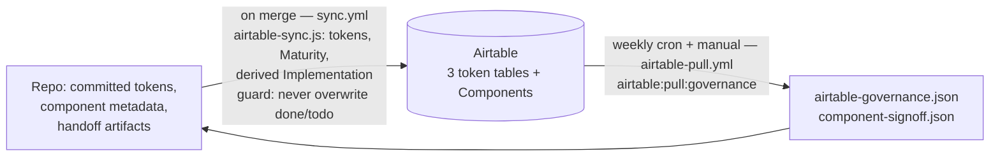

---
sources:
  - scripts/airtable-sync.js
  - scripts/airtable-pull.js
  - scripts/airtable-ids.js
  - scripts/airtable-setup-governance.js
  - scripts/lib.js
  - .env.example
  - .github/workflows/sync.yml
  - .github/workflows/airtable-pull.yml
  - docs/decisions/002-three-layer-token-model.md
  - docs/decisions/003-root-token-convention.md
  - docs/decisions/010-component-lifecycle-two-axes.md
  - .claude/commands/airtable-sync.md
  - .claude/commands/token-deprecation-pass.md
# clock reset 2026-07-10: /token-deprecation-pass gains a pre-PR deterministic gate; governance flows unchanged, still accurate
# verified 2026-07-13 (issue #74): checked against ADR-010 amendments (4 broad stages, full/standard rename); derived stages already read `in progress`/`in review` from the #64 sweep, guard and push/pull flows unchanged by design, still accurate
# clock reset 2026-07-23 (issue #85): added "Base schema & setup" section (tables/columns, env vars, rebuild path); no change to the sync/pull direction rules above
---
# Governance

## What it is

Airtable is the system's governance layer: it holds per-token lifecycle fields (`status`, `owner`, `successor`, `notes`) and the per-component human sign-off. Data flows in **both directions, through different channels with different owners**: code pushes its state to Airtable on merge; humans author governance decisions in Airtable, which are pulled back into committed JSON files that scripts and agents read. Nothing reads Airtable live during a task — governance state is always consumed from the committed snapshot.

## Why it's built this way

### Each direction has one owner

The direction split comes from [ADR-002](decisions/002-three-layer-token-model.md) (token governance is authored in Airtable, pulled to code) and [ADR-010](decisions/010-component-lifecycle-two-axes.md) (component state is split by axis — see [Component lifecycle](02-component-lifecycle.md)). The constraint ADR-010 spells out: `airtable-sync.js` is a partial-[upsert](08-glossary.md) push: it updates only the fields it pushes (overwriting them on every sync) and never clears fields it omits — so "a value a human edits in a *pushed* field is overwritten on the next sync." The only safe design is to never let a human-owned value and a code-owned value share a column, and to make the pull (not a live API read) the way agents see human decisions.

### The "don't downgrade done" guard

The one place the two directions could still collide is the component `Implementation` column: code pushes derived stages (`in progress`/`in review`) into the same column where humans write `done`/`todo`. ADR-010's guard: `push:components` reads the current Implementation value before writing and **skips the cell entirely if Airtable already holds `done` or `todo`**. Combined with partial upserts (omitted fields are never cleared), human values are immune to the sync. `done`/`todo` rows are also exempt from orphan deletion — the sync's cleanup step that removes Airtable rows whose code-side counterpart no longer exists.

### ADR practice is itself a governance artifact

The decision records in `docs/decisions/` follow the same discipline as the data flows: decisions are amended in place (dated `## Amendment` sections, bumped `Amended:` date) rather than rewritten, and a full reversal is recorded as a supersession, not a deletion. The worked example is [ADR-003](decisions/003-root-token-convention.md): it originally declared `$root` the sole group-default convention. The 2026-06-14 semantic naming audit fully reversed that in favor of `.default`, the convention W3C DTCG, Tokens Studio, and Style Dictionary all converge on. `$root` had needed a custom preprocessor and produced meaningless `-root` CSS suffixes. The reversal lives as a supersession note at the top of the original ADR, status `superseded` — the wrong decision and its correction both stay on the record, for the same reason the Airtable columns separate human values from pushed values: governance is only trustworthy when no process can silently overwrite another's history. (ADR-003 predates the current amend-vs-new-file convention in `CLAUDE.md` and is itself the precedent that shaped it.)

## How it works, concretely

**Code → Airtable** (push, automated on merge): `scripts/airtable-sync.js` upserts primitives, semantic, and device tokens to three tables via direct REST, and pushes component `Maturity` plus the derived `Implementation` stage. Runs in CI via `.github/workflows/sync.yml` (the post-merge sync, which also recommits the refreshed frozen snapshots); locally via the `airtable:push:*` / `airtable:sync:*` scripts. Requires `AIRTABLE_API_KEY` in the environment (a `.env` file locally, a repository secret in CI — never committed).

**Airtable → code** (pull, automated weekly): `.github/workflows/airtable-pull.yml` runs the pull every Monday (plus on demand via `workflow_dispatch`) and commits the snapshots if they changed — the formerly remaining Phase 6 item. Run it manually when you need fresh governance state *now*, e.g. right before deprecation work:

```bash
npm run airtable:pull:governance
```

`scripts/airtable-pull.js` writes two committed snapshots:

- `packages/tokens/airtable-governance.json` — per token: `status` (`active`|`deprecated`), `owner`, `successor` (a dot-path like `color.terracotta.9`, nullable), `notes`
- `.claude/component-signoff.json` — per component: the human `Implementation` sign-off (`done`/`todo`)

These committed files are what everything downstream reads. Since the 2026-07-13 ADR-002 amendment, `airtable:pull:governance` also chains `scripts/token-deprecation-mirror.js`, which mirrors each deprecated token's governance state into the DTCG `$deprecated` property on the affected leaf in `packages/tokens/src/` — the committed token source becomes the durable deprecation record, not just `airtable-governance.json`. `/token-deprecation-pass` now reads `$deprecated` straight from source as the primary record, using `airtable-governance.json` only as a cross-check; `npm run tokens:deprecations:check` (CI-gated in `tokens-check.yml`) fails a PR where the two have drifted apart. Read end to end, deprecation is a closed loop: an Airtable decision mirrors into source `$deprecated`, a repo scan of usages feeds `sense.js`'s migration-backlog table in `STATUS_QUO.md`, and `/token-deprecation-pass` closes it with a migration PR — see [Self-improving loops](11-self-improving-loops.md). The `/airtable-sync` command wraps both directions using the committed scripts. Run the pull before any deprecation or sign-off work so the snapshot — and the mirrored `$deprecated` state — are fresh.

## Base schema & setup

The base ID, table IDs, and table names are centralized in `scripts/airtable-ids.js` — every script imports from there rather than hardcoding identifiers. `AIRTABLE_BASE_ID` defaults to `appBfY2arkReKQNit` if the env var isn't set (see [Environment variables](#environment-variables) below); this is the actual base backing the flows on this page, not a placeholder.

### Tables and columns

Four tables, all in the same base:

| Table | ID | Purpose |
|---|---|---|
| Primitive tokens | `tblAl09uImcO1VPeb` | One row per primitive token path (`color.terracotta.9`, etc.) |
| Semantic tokens | `tblxMSyL7EFIXltqX` | One row per theme-layer alias, light/dark side by side |
| Device tokens | `tblQvDDo0EZoiYrdf` | One row per device-layer token, desktop/tablet/mobile side by side (no governance columns — informational only, not deprecated/owned per-token) |
| Components | `tblT79kVwnCZJdlQE` | One row per component: metadata mirror plus the two-axis lifecycle (Maturity/Implementation) |

**Primitive tokens** and **Semantic tokens** carry the same four governance columns, added by `airtable-setup-governance.js` and read by `scripts/airtable-pull.js` (`GOV_FIELDS`):

| Column | Owner | Direction | Notes |
|---|---|---|---|
| `Status` | Human | Airtable → code | `active` / `deprecated`, single select. Absent = treated as active downstream. |
| `Owner` | Human | Airtable → code | Free text. |
| `Successor` | Human | Airtable → code | Free text, a dot-path like `color.terracotta.9` when set, nullable. |
| `Notes` | Human | Airtable → code | Free text. |

These four are never pushed by `airtable-sync.js` — only `push:primitives`/`push:semantic` write the value/path/group columns (`Primitives`/`Value`/`Group` and `Token name`/`Light theme alias`/`Light theme value`/`Dark theme alias`/`Dark theme value`/`Usage`/`Component`), so a human editing `Status`/`Owner`/`Successor`/`Notes` never collides with a code-pushed column. This is the "each direction has one owner" rule above, applied at the column level.

**Components** mixes code-pushed and human-owned columns in one table (`COMPONENT_FIELDS` in `airtable-sync.js`):

| Column | Owner | Direction | Notes |
|---|---|---|---|
| `Name` | Code | Code → Airtable | Merge key for the upsert. |
| `Type`, `Variants`, `Color tokens`, `Spacing tokens`, `Typography tokens`, `Border radius tokens`, `Other tokens`, `Figma node ID`, `Version` | Code | Code → Airtable | Mirrored from each component's `metadata.json`. |
| `Maturity` | Code | Code → Airtable | `component.status` (`beta`/`ready`/`deprecated`) from metadata. |
| `Implementation` | **Split** | Both, guarded | Code writes the derived stage (`in progress`/`in review`, from `sense.js` via `component-pipeline.json`) — but only if the cell doesn't already hold `done` or `todo`. A human sets `done`/`todo` directly in Airtable; `airtable-pull.js` reads those two values back into `.claude/component-signoff.json` and never pulls the derived stages (that would be circular). See the guard in `pushComponents()` (`HUMAN_OWNED_IMPL = new Set(["done", "todo"])`) and [ADR-010](decisions/010-component-lifecycle-two-axes.md). |

Rows with `Implementation` = `done`/`todo` are also exempt from the sync's orphan-deletion cleanup, so a maintainer can queue a planned (codeless) component in Airtable without a sync run deleting it.

### Environment variables

Both variables the sync/pull/setup scripts read are documented in `.env.example` (copy it to `.env`, gitignored, never commit real keys):

| Var | Required | Purpose |
|---|---|---|
| `AIRTABLE_API_KEY` | Yes | Personal access token. Needs `data.records:read` + `data.records:write` scopes for sync/pull; `airtable:setup` (schema changes) additionally needs `schema.bases:write`. Add the base to the token's access list at https://airtable.com/create/tokens. Set as a repository secret in CI, a local `.env` (or shell `export`, which overrides `.env`) otherwise. |
| `AIRTABLE_BASE_ID` | No | Overrides the `appBfY2arkReKQNit` fallback in `scripts/airtable-ids.js`. Only needed when pointing at a different base (e.g. a personal sandbox). |

### Rebuilding the base from scratch

The four tables and their non-governance columns (token path/value, component metadata mirror) are created implicitly by the first `push:*` run against an empty base — `performUpsert` creates rows, but **not** tables or fields; those must already exist with matching names. To add the four governance columns (`Status`/`Owner`/`Successor`/`Notes`) to Primitive tokens and Semantic tokens, run:

```bash
npm run airtable:setup
```

This runs `scripts/airtable-setup-governance.js`, which is idempotent — it lists each target table's existing fields via the meta API and skips any governance field that's already there, so it's safe to re-run after a partial failure or when onboarding a new base. It requires the `schema.bases:write` scope in addition to the record scopes above.

## Diagram



## Related

- ADRs: [010 — Two-axis lifecycle](decisions/010-component-lifecycle-two-axes.md) (the guard), [002 — Three-layer token model](decisions/002-three-layer-token-model.md) (governance direction precedent), [003 — `$root` convention](decisions/003-root-token-convention.md) (supersession as the worked example)
- Case study: [Airtable governance flow, both directions](case-study-source/03-airtable-governance-flow.md) — narrative walkthrough of why the same-column rule exists, with the `Select`/`Accordion` incident that motivated ADR-010
- Commands: `/airtable-sync`, `/token-deprecation-pass` (in `.claude/commands/`)
- Setup: `scripts/airtable-setup-governance.js` (`npm run airtable:setup`), `.env.example`
- Scripts: `scripts/airtable-sync.js`, `scripts/airtable-pull.js`; `npm run airtable:pull:governance`, `npm run airtable:sync:all` — see the [CLI reference](07-cli-reference.md)
