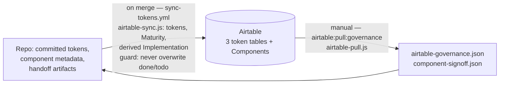

# Governance

## What it is

Airtable is the system's governance layer: it holds per-token lifecycle fields (`status`, `owner`, `successor`, `notes`) and the per-component human sign-off. Data flows in **both directions, through different channels with different owners**: code pushes its state to Airtable on merge; humans author governance decisions in Airtable, which are pulled back into committed JSON files that scripts and agents read. Nothing reads Airtable live during a task — governance state is always consumed from the committed snapshot.

## Why it's built this way

### Each direction has one owner

The direction split comes from [ADR-002](decisions/002-three-layer-token-model.md) (token governance is authored in Airtable, pulled to code) and [ADR-010](decisions/010-component-lifecycle-two-axes.md) (component state is split by axis — see [Component lifecycle](02-component-lifecycle.md)). The constraint ADR-010 spells out: `airtable-sync.js` is a partial-upsert push that overwrites pushed fields on every sync — so "a value a human edits in a *pushed* field is overwritten on the next sync." The only safe design is to never let a human-owned value and a code-owned value share a column, and to make the pull (not a live API read) the way agents see human decisions.

### The "don't downgrade done" guard

The one place the two directions could still collide is the component `Implementation` column: code pushes derived stages (`in progress`/`in review`/`established`) into the same column where humans write `done`/`todo`. ADR-010's guard: `push:components` reads the current Implementation value before writing and **skips the cell entirely if Airtable already holds `done` or `todo`**. Combined with partial upserts (omitted fields are never cleared), human values are immune to the sync. `done`/`todo` rows are also exempt from orphan deletion.

### ADR practice is itself a governance artifact

The decision records in `docs/decisions/` follow the same discipline as the data flows: decisions are amended in place (dated `## Amendment` sections, bumped `Amended:` date) rather than rewritten, and a full reversal is recorded as a supersession, not a deletion. The worked example is [ADR-003](decisions/003-root-token-convention.md): it originally declared `$root` the sole group-default convention; the 2026-06-14 semantic naming audit fully reversed that in favor of `.default` (the W3C DTCG / Tokens Studio / Style Dictionary convergence — `$root` needed a custom preprocessor and produced meaningless `-root` CSS suffixes). The reversal lives as a supersession note at the top of the original ADR, status `superseded` — the wrong decision and its correction both stay on the record, for the same reason the Airtable columns separate human values from pushed values: governance is only trustworthy when no process can silently overwrite another's history. (ADR-003 predates the current amend-vs-new-file convention in `CLAUDE.md` and is itself the precedent that shaped it.)

## How it works, concretely

**Code → Airtable** (push, automated on merge): `scripts/airtable-sync.js` upserts primitives, semantic, and device tokens to three tables via direct REST, and pushes component `Maturity` plus the derived `Implementation` stage. Runs in CI via `.github/workflows/sync-tokens.yml`; locally via the `airtable:push:*` / `airtable:sync:*` scripts. Requires `AIRTABLE_API_KEY` in the environment (a `.env` file locally, a repository secret in CI — never committed).

**Airtable → code** (pull, manual until Phase 6 automates it):

```bash
npm run airtable:pull:governance
```

`scripts/airtable-pull.js` writes two committed snapshots:

- `packages/tokens/airtable-governance.json` — per token: `status` (`active`|`deprecated`), `owner`, `successor` (a dot-path like `color.terracotta.9`, nullable), `notes`
- `.claude/component-signoff.json` — per component: the human `Implementation` sign-off (`done`/`todo`)

These committed files are what everything downstream reads. The `/token-deprecation-pass` command, for example, reads `airtable-governance.json` (never the Airtable MCP) and migrates every usage of a deprecated token to its `successor`. The `/airtable-sync` command wraps both directions using the committed scripts. Run the pull before any deprecation or sign-off work so the snapshot is fresh.

## Diagram



## Related

- ADRs: [010 — Two-axis lifecycle](decisions/010-component-lifecycle-two-axes.md) (the guard), [002 — Three-layer token model](decisions/002-three-layer-token-model.md) (governance direction precedent), [003 — `$root` convention](decisions/003-root-token-convention.md) (supersession as the worked example)
- Commands: `/airtable-sync`, `/token-deprecation-pass` (in `.claude/commands/`)
- Scripts: `scripts/airtable-sync.js`, `scripts/airtable-pull.js`; `npm run airtable:pull:governance`, `npm run airtable:sync:all` — see the [npm scripts reference](07-npm-scripts-reference.md)
