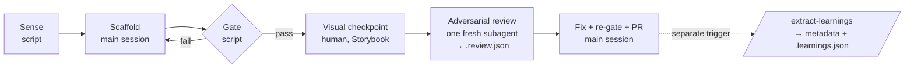

---
sources:
  - .claude/commands/*.md
  - .claude/agents/adversarial-reviewer.md
  - docs/decisions/007-verified-component-loop.md
  - docs/decisions/016-layout-output-review-path.md
  - scripts/docs-check.js
  - scripts/sense.js
  - scripts/sense-component.js
---
# Agentic moments

## What it is

Agent involvement in this system is limited to **nine developer-triggered moments**, each defined as a prompt file in `.claude/commands/`. Everything else — anything recurring, scheduled, or CI-bound — is a script or a GitHub Action calling REST APIs directly. This is the "lite agentic" charter: agents only do what a script can't, only when a developer asks, and always inside a bounded sequence that stops.

## Why it's built this way

The charter's economics are stated in `CLAUDE.md` and made concrete in [ADR-007](decisions/007-verified-component-loop.md): the runtime is Claude Pro, where "the scarce resource is a rolling usage window with weekly caps, *not* per-token dollars. Anything that runs N agents at once drains the window N× simultaneously and trips rate limits." Add the Figma plan wall (the Variables REST API is Enterprise-only, so variables are readable only interactively via the plugin/MCP) and the picture is fixed: MCP is for one-off interactive tasks with the developer present; recurring work is deterministic scripts; agents are bounded moments.

ADR-007 documents this by contrast with a blueprint it evaluated and rejected ("In-Demand, API-Driven Agentic Loop Architecture"): a parallel 2–3 worker swarm, Sonnet-router/Haiku-worker cost tiering (a large model routing tasks to small, cheap models that execute them), and Figma variables over REST. All three load-bearing assumptions were false for this setup — parallel is the *expensive* path on Pro, the REST endpoint is Enterprise-gated, and per-token tiering assumes API credits that don't exist. The blueprint's three plan-independent good ideas were kept: **frozen state-file [handoffs](08-glossary.md), an [adversarial](08-glossary.md) verification stage, and on-demand triggering.**

One boundary is worth stating explicitly (from `CLAUDE.md`): a developer-triggered loop that runs a bounded sequence once and stops is allowed — it's a moment with stages. A *continuous* loop, scheduled agent run, or always-on watcher is not; the documented response to a request for one is to push back and propose a script, a GitHub Action, or an existing moment.

## The nine moments

Each command file in `.claude/commands/` holds the full inputs, steps, and success signals; `CLAUDE.md` holds the index and the invariant each moment must never violate:

| # | Moment | Command | Load-bearing invariant |
|---|---|---|---|
| 1 | Figma variable audit (drift check) | `/figma-variable-audit` | Never overwrite primitives without diffing against usage; capture the read into `figma-variables.json`; exclude representational divergences from the drift report. |
| 2 | Token deprecation pass | `/token-deprecation-pass` | Replace usages with the Airtable `successor`; read `airtable-governance.json`, no MCP. |
| 3 | Component scaffold | `/component-scaffold` | Read schema + template + Figma context; produce the four component files. |
| 4 | Layout generation | `/layout-generation` | Only fixed-set components and tokens; every structural choice cites a metadata rule. Output reaches `main` only via a `layout/<kebab-name>` PR, reviewed in-session by default ([ADR-016](decisions/016-layout-output-review-path.md)). |
| 5 | Figma variable push (code → Figma) | `/figma-variable-push` | Write only clean-missing variables; never delete or overwrite Figma variables without explicit confirmation. |
| 6 | Add component (verified scaffold) | `/add-component` | The ad-hoc loop: sense → scaffold → gate → visual checkpoint → moment 7. Frozen snapshot is the only handoff. ADR-007. |
| 7 | Review component (adversarial review + fix + PR) | `/review-component` | One fresh adversarial subagent; branch `component/<kebab-name>`; writes `.review.json` + `.run.json` for moment 8. |
| 8 | Extract learnings (metadata self-improvement) | `/extract-learnings` | Route each finding to its durable home — component metadata first; token conventions → `/tokens-author`, contrast misses → the curated `PAIRS` list; scope stays component/layout/token contracts. `--all` proposes CLAUDE.md additions and `/layout-generation` pattern-section pruning (developer confirms both). |
| 9 | Docs sync (rewrite stale reference pages) | `/docs-sync` | Detection is CI (`npm run docs:check`); rewriting is this developer-triggered moment, never CI. Rewrite only the stale sections; never touch prop tables or anything Autodocs/docgen owns. Before the PR, one read-only `docs-scribe` subagent reviews the rewritten sections for first-read comprehension (ADR-018). Opens a PR (`docs-sync/<date>` branch). |

Moment 9 (added 2026-07-08) closes the self-documenting gap for this very site: each `docs/NN-*.md` page declares its load-bearing source files in `sources:` frontmatter, `scripts/docs-check.js` fails (locally and via `docs-check.yml` on every PR) when any source has a commit newer than the doc, and `/docs-sync` is the judgment layer that rewrites the stale sections — the same detection-is-a-script / rewriting-is-a-moment split as everywhere else in the charter. Since ADR-018 the moment also has a scribe/critic stage: after the rewrite and before the PR, it spawns one read-only `docs-scribe` subagent (`.claude/agents/docs-scribe.md`) that reviews the rewritten sections for first-read comprehension by three stakeholder audiences — PM, product designer, engineer — against the glossary term canon. Same "reports, never fixes" tool boundary as the `adversarial-reviewer`: the subagent returns findings; the main session applies the ones it accepts.

Since 2026-07-08 the charter is also *structurally enforced*, not just prose: every command file carries `model:` frontmatter (mechanical moments run on cheaper tiers; generative and review moments on the default model) and an `allowed-tools:` allowlist. A moment whose invariant says "no MCP" — `/token-deprecation-pass`, for example — now simply cannot reach the Airtable MCP; the CLAUDE.md MCP table stopped being a convention agents must remember and became a tool boundary.

Two supporting rules from `CLAUDE.md`'s MCP table: never put an MCP call inside a GitHub Action or a loop over many records; and if a task could be done with a committed file, a script, or the `gh` CLI, do it that way even when an MCP tool is available. Airtable governance state in particular is always read from the committed `airtable-governance.json`, never live.

## Frozen-memory snapshots

Moments read the system's status quo from **committed files, never live APIs** — this shields agents from rate limits and keeps each agent's context small. The read-not-call artifacts:

| File | Source | Captured by |
|---|---|---|
| `airtable-governance.json` | Airtable governance fields | `scripts/airtable-pull.js` |
| `token-usage.json` | Repo scan (`var(--ds-*)` + `{alias}` refs) | `scripts/token-usage.js` |
| `figma-variables.json` | Figma variables | `/figma-variable-audit` via Figma MCP (Plugin API — the REST pull is Enterprise-gated) |
| `.claude/component-signoff.json` | Airtable human `done`/`todo` | `scripts/airtable-pull.js` |
| `.claude/component-pipeline.json`, `.claude/STATUS_QUO.md` | Aggregate of the above | `scripts/sense.js` (`npm run sense`) |
| `.claude/component-patterns.json` | Cross-component pattern aggregate (deterministic AST + metadata scan) | `scripts/generate-pattern-schema.js` (`npm run patterns:generate`) |
| `.claude/handoff/runs/<Name>.snapshot.json` | The above, narrowed to one component | `scripts/sense-component.js` (`npm run sense:component <Name>`) |

## The verified `/add-component` loop, concretely

The flagship moment (6) is a bounded loop with stages, per ADR-007 — **sequential, at most two agents, frozen-file handoffs only**:

- **Stage 0 — Sense** (script, no AI): `npm run sense:component <Name>` writes `.claude/handoff/runs/<Name>.snapshot.json` from the committed frozen-memory files. No live API call.
- **Stage 1 — Scaffold** (main session): reuses `/component-scaffold`, fed only the snapshot + schema + a template component.
- **Stage 2 — Gate** (script): `metadata:validate && typecheck && build && a11y:coverage && a11y:test && patterns:generate` (the a11y steps added by the ADR-007 amendment — see [Accessibility](03-accessibility.md); `patterns:generate` refreshes `.claude/component-patterns.json`, committed alongside the component — ADR-013). Fail-fast: a failure bounces back to Stage 1 with the error.
- **Stage 2b — Visual checkpoint** (human): go/no-go in Storybook, light and dark themes.
- **Stage 3+ — Review + PR**: delegates to `/review-component`, which spawns the loop's *one* subagent — a fresh adversarial reviewer with independent context. The reviewer is **read-only by construction**: it is a committed agent definition (`.claude/agents/adversarial-reviewer.md`) whose tool set is Read/Grep/Glob/Bash only — no Edit, no Write — so "reviewer reports, never fixes" is enforced by the tool boundary, not just the prompt. It returns structured findings, and the *main session* persists them to `.claude/handoff/runs/<Name>.review.json`, applies fixes, re-runs the gate, and opens a PR on a `component/<kebab-name>` branch. No agent-written code reaches `main` unreviewed — this is also one of the three exceptions to the repo's no-new-branches workflow (the others are moment 9's `docs-sync/<date>` branch and moment 4's `layout/<kebab-name>` branch per [ADR-016](decisions/016-layout-output-review-path.md), for the same reason: agent-generated content goes through a PR).
- **Afterwards — `/extract-learnings`** (separate trigger) closes the loop: it routes each `.review.json` finding to its durable home. Component contracts go to the right metadata section (ARIA attributes → `accessibility.ariaAttributes`, keyboard → `accessibility.keyboardInteractions`, focus → `accessibility.notes`, consumer misuse → `usage.antiPatterns`, child/parent constraints → `composition.accepts`/`containedBy`). Since 2026-07-08 the routing also covers three learning kinds that previously had no target:
  - Layout/composition mistakes tied to one component → that component's `usage.patterns`/`usage.antiPatterns`. Only genuinely cross-component grammar may enter `/layout-generation`'s pattern section, and only with confirmation.
  - Token-convention violations → `/tokens-author`'s Conventions section.
  - Contrast misses → a new pair in the curated `PAIRS` list in `scripts/token-contrast-check.js` (never a waiver).

  The command gates on `metadata:validate` (plus `tokens:contrast-check` when `PAIRS` changed) and writes `.learnings.json` — the "processed" marker `sense.js` reads to derive the `in review` stage. In `--all` mode it may *propose* (never auto-apply) a `CLAUDE.md` addition when a pattern repeats across components, and runs a consolidation pass over `/layout-generation`'s hand-accreted "Recurring patterns" section — flagging entries now duplicated by metadata or `component-patterns.json` with a prune/move/keep disposition, again applied only on developer confirmation. Scope is deliberately bounded to component, layout, and token contracts; process and tooling mistakes are skipped, not routed. Fixes that land only in code rot; landing them in the system's contracts is what makes it self-improving.

A full worked example of this loop running on a real component is documented in **[The Add-Component Loop — Accordion Case Study](add-component-loop-case-study.html ':ignore')**, a standalone HTML artifact. It records, among other things, a real ARIA dead-reference bug (`aria-controls` pointing at a non-existent id) that the adversarial reviewer caught and the deterministic gate could not have. Note: `ROADMAP.md` flags that this write-up may be stale relative to the loop's current shape — the stages above (per ADR-007 and its amendment) are authoritative where they differ.

## Related

- ADRs: [007 — Verified component loop](decisions/007-verified-component-loop.md) (+ amendment)
- All eleven command files in `.claude/commands/`: the nine moments above plus `/tokens-author` (token authoring — see [Token pipeline](01-token-pipeline.md)) and `/airtable-sync` (sync wrapper — see [Governance](05-governance.md)); the read-only reviewer agent definition in `.claude/agents/adversarial-reviewer.md`
- `CLAUDE.md` sections: "Agentic moments", "MCP tools — when to use vs when to avoid", "Frozen-memory snapshots"
- Scripts: `npm run sense`, `npm run sense:component` — see the [npm scripts reference](07-npm-scripts-reference.md)
