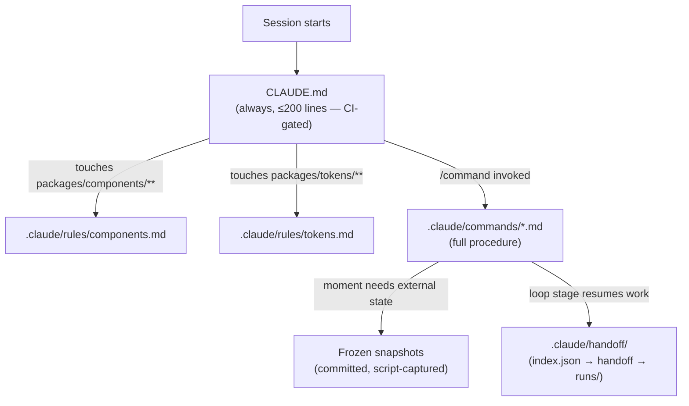

---
sources:
  - CLAUDE.md
  - .claude/rules/components.md
  - .claude/rules/tokens.md
  - scripts/claude-md-check.js
  - scripts/handoff-tidy.js
  - scripts/docs-check.js
  - docs/decisions/013-cross-component-pattern-schema.md
  - docs/decisions/015-handoff-artifact-lifecycle.md
  - docs/decisions/017-claude-md-context-budget.md
# clock reset 2026-07-13: #70 adds a $deprecated exception note to CLAUDE.md and .claude/rules/tokens.md; the layering/budget mechanics this page describes are unchanged, still accurate
# verified 2026-07-13 (issue #74): checked against ADR-015 amendment and CLAUDE.md as of #65-#68 + the full/standard rename; handoff-lifecycle section already describes the review-state baseline + checklist derivation from the #64 sweep, "adversarial" survives as the full path's description per ADR-010, still accurate
---
# Context engineering

## What it is

Everything under `.claude/` — plus `CLAUDE.md` at the repo root — forms a single subsystem: the **instruction architecture** that decides what an agent knows, when it knows it, and what that knowledge costs. It is engineered the same way the token pipeline is: explicit layers, one owner per layer, and CI gates instead of discipline.

The organizing idea is a ladder of surfaces, each loaded at the narrowest possible scope:

| Rung | Surface | Loaded | Carries |
|---|---|---|---|
| 1 | `CLAUDE.md` | Every session, always | Cross-cutting invariants, indexes that point elsewhere, policy that applies to any session. CI-capped at 200 lines / 20KB. |
| 2 | `.claude/rules/*.md` | Only when the session touches a file matching the rule's `paths:` [globs](08-glossary.md) | Package-scoped conventions — `components.md` (`packages/components/**`), `tokens.md` (`packages/tokens/**`). |
| 3 | `.claude/commands/` and `.claude/skills/` | Only when invoked by name | Full procedures for the [nine agentic moments](06-agentic-moments.md) plus `/tokens-author` and `/airtable-sync`. |
| 4 | Frozen snapshots (`.claude/STATUS_QUO.md`, `component-pipeline.json`, `airtable-governance.json`, …) | Read by a moment that needs external state | The status quo of Airtable, Figma, and the repo — captured by scripts, never fetched live mid-task. |
| 5 | `.claude/handoff/` | Read by the specific loop stage or session resuming the work | Cross-session markdown handoffs (committed, lifecycle-tracked), per-run JSON under `runs/` (gitignored, regenerable), and the append-only `run-ledger.json`. |

Each rung defers cost until the knowledge is actually needed. A token-authoring session never pays for component CSS conventions; a session that never invokes `/layout-generation` never loads the layout grammar's full procedure.

## Why it's built this way

The always-loaded surface competes with the actual task for [context-window](08-glossary.md) space, and every line in it is a recurring cost paid on every session forever. [ADR-017](decisions/017-claude-md-context-budget.md) records the failure this page exists to prevent: `CLAUDE.md` had grown to 289 lines / ~35KB, past the point where Anthropic's guidance warns that adherence measurably drops — instructions get lost in the noise and are silently ignored. Worse, the growth was *structural*, not accidental: the old ADR convention said "reflect the rule in the relevant CLAUDE.md section too," making the always-loaded file the dumping ground for every *what to do* simply because it was the only surface guaranteed to be visible.

The fix follows the repo's standing principle — never enforce by prose what a script can gate. Pruning once and relying on discipline treats the symptom; `@imports` (CLAUDE.md's built-in mechanism for pulling other files into the always-loaded instructions) reorganize the text but still load it all at launch, saving zero context. The chosen design (path-scoped rules + a routing table + a deterministic budget gate) attacks the growth engine itself.

The handoff area went through the same correction one ADR earlier. [ADR-015](decisions/015-handoff-artifact-lifecycle.md) found `.claude/handoff/` holding three artifact kinds with no lifecycle signal — done and active work indistinguishable without opening each file. The whole directory was also excluded from version control (gitignored), contradicting the project's own convention that durable handoffs are committed. The pattern of the fix is identical: a small mandatory convention (3-line frontmatter), a script that enforces it by failing loudly (`npm run handoff:tidy`), and a generated index (`handoff/index.json`) so future sessions read one file instead of globbing a directory.

A third principle governs what gets *added* to any of these surfaces: **measure, don't assert.** [ADR-013](decisions/013-cross-component-pattern-schema.md) is the worked example — before `component-patterns.json` was allowed into any prompt, a before/after harness ran 7 pre-registered tasks — fixed in advance, before any results were seen — through both arms (once with `component-patterns.json` in the prompt, once without) and found the file *improved* layout/composition tasks but *worsened* scaffolds. The consequence is a consumption rule (only `/layout-generation` reads it, never `/component-scaffold`) that would have been invisible without the measurement. The same instinct produced `run-ledger.json`: per-run review telemetry survives in a committed append-only ledger precisely so the adversarial-review stage's cost can eventually be judged empirically rather than defended rhetorically.

## How it works, concretely

### The routing table and its litmus test

`CLAUDE.md`'s "Where knowledge lives" section is the map every addition must pass through. Each kind of knowledge routes to the narrowest surface visible when it matters: component-only detail → `.claude/rules/components.md`; token-only detail → `.claude/rules/tokens.md`; procedures → the relevant command; rationale and history → the ADR; human-facing reference → this docs site; anything that must happen every time → a script or CI gate, never prose. The per-line litmus test: *would removing it cause a mistake in most sessions?* If not, it lives elsewhere. The ADR convention was amended to match — the ADR holds the *why*; the *what to do* lands on the narrowest visible surface, `CLAUDE.md` only when cross-cutting.

### The budget gate

`npm run claudemd:check` (`scripts/claude-md-check.js`, wired into `docs-check.yml` on every PR) fails when `CLAUDE.md` exceeds 200 lines or 20KB — and, just as importantly, when any `.claude/rules/*.md` is missing `paths:` frontmatter, because an unscoped rule loads unconditionally into every session and silently defeats the entire split. Future bloat is caught at PR time, not by noticing degraded agent behavior months later.

```yaml
# .claude/rules/tokens.md — the frontmatter that makes rung 2 work
---
paths:
  - packages/tokens/**
---
```

### Commands vs skills

One naming trap, stated once: Claude Code's terms are the inverse of intuition. `.claude/commands/` holds prompt-only slash commands (all nine agentic moments); `.claude/skills/` holds commands that ship companion *code* — here only `run-storybook`, whose `driver.mjs` drives Storybook headlessly. Since the 2026-07-08 audit, every command file also carries `model:` and `allowed-tools:` [frontmatter](08-glossary.md), turning "this moment must not use [MCP](08-glossary.md)" from a remembered convention into a tool boundary (see [Agentic moments](06-agentic-moments.md)).

### The handoff lifecycle

Markdown handoffs are committed, named `YYYY-MM-DD-slug.handoff.md`, and carry `status: active | done | superseded` plus `created:`/`completed:` dates. `npm run handoff:tidy` is the only thing that moves files: it archives `done`/`superseded` handoffs into `handoff/archive/` (nothing is ever deleted — archives are permanent), regenerates `handoff/index.json`, and promotes each per-run `<Name>.run.json` into `run-ledger.json`. A handoff missing frontmatter is a hard failure at tidy time — deliberate friction, per ADR-015, so the convention can't erode back into the pre-ADR state. Per-run JSON (`<Name>.{snapshot,review,run,learnings}.json`) lives under the gitignored `.claude/handoff/runs/` because it is regenerable (`npm run sense:component <Name>`); the run files persist there indefinitely because `scripts/sense.js` merges their presence over the committed `.claude/component-review-state.json` baseline to derive a component's pipeline stage (`in progress` / `in review`) and the state of its review checklist.

### The enforcement layer, in one table

| Gate | Script | Fails when |
|---|---|---|
| Context budget | `npm run claudemd:check` | `CLAUDE.md` > 200 lines / 20KB, or a rules file lacks `paths:` |
| Docs staleness | `npm run docs:check` (`docs-check.yml`) | Any `sources:` file of a `docs/NN-*.md` page has a commit newer than the page |
| Snapshot staleness | `components-check.yml` | A PR touches components while `component-patterns.json` is stale |
| Handoff convention | `npm run handoff:tidy` | Any handoff/spec markdown lacks lifecycle frontmatter |

The division of labor is the same everywhere: **detection is a script; judgment is a developer-triggered moment.** `docs:check` detects that this very page is stale; `/docs-sync` rewrites it.



## Related

- ADRs: [013 — Cross-component pattern schema](decisions/013-cross-component-pattern-schema.md), [015 — Handoff artifact lifecycle](decisions/015-handoff-artifact-lifecycle.md), [017 — CLAUDE.md context budget](decisions/017-claude-md-context-budget.md)
- `CLAUDE.md` sections: "Where knowledge lives", "Frozen-memory snapshots", "Commands and skills"
- Scripts: `npm run claudemd:check`, `npm run handoff:tidy`, `npm run docs:check`, `npm run sense` — see the [npm scripts reference](07-npm-scripts-reference.md)
- Glossary entries this page connects: CLAUDE.md, Rules (path-scoped), Progressive disclosure, Frozen snapshot, Handoff, Ledger — [Glossary](08-glossary.md)
- The lite-agentic charter these mechanics serve: [Agentic moments](06-agentic-moments.md)
