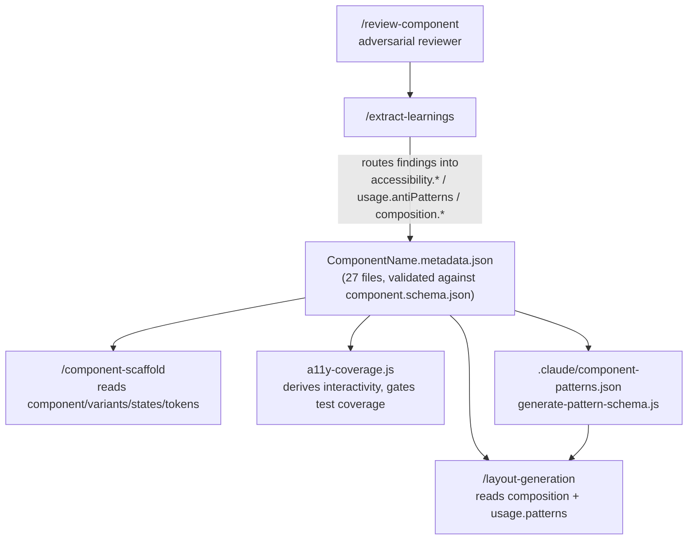

---
sources:
  - packages/components/component.schema.json
  - scripts/validate-metadata.js
  - scripts/generate-pattern-schema.js
  - scripts/a11y-coverage.js
  - docs/decisions/001-component-metadata-schema.md
  - docs/decisions/013-cross-component-pattern-schema.md
---
# Machine-readable metadata

## What it is

Every component ships a `<Name>.metadata.json` file — a structured fact sheet covering its purpose, variants, states, tokens, accessibility contract, and its place in the component graph. That per-component contract is the base of a four-layer stack: a schema validates it, a scanner aggregates all 27 files into a cross-component index, and three downstream consumers (a11y coverage, layout generation, and the learnings loop) read from it instead of from implementation code. The point of the stack is that an agent — or a developer — can generate or verify a component without reading its `index.tsx`.

| Layer | Files | Producer | Consumers | CI gate | ADR |
|---|---|---|---|---|---|
| Per-component contract | `<Name>.metadata.json` (27 files) + `component.schema.json` | Component author, via `/component-scaffold` or hand-edit | `/component-scaffold`, `/layout-generation`, `a11y-coverage.js`, `/extract-learnings` | `metadata:validate` in `components-check.yml` | [001](decisions/001-component-metadata-schema.md) |
| Validation | `scripts/validate-metadata.js` | Script (Ajv, draft 2020-12) | Every moment that trusts a metadata file is well-formed and token-accurate | `metadata:validate` in `components-check.yml` | [001](decisions/001-component-metadata-schema.md) |
| Cross-component aggregate | `.claude/component-patterns.json` | `scripts/generate-pattern-schema.js` (`npm run patterns:generate`) | `/layout-generation` only | Staleness check (regenerate + `git diff --exit-code`) in `components-check.yml` | [013](decisions/013-cross-component-pattern-schema.md) |
| Downstream consumers | a11y coverage derivation, layout citations, `/extract-learnings` write-back | `scripts/a11y-coverage.js`, `/layout-generation`, `/extract-learnings` | Developers and agents building pages and tests | `a11y:coverage` in `components-check.yml` | [008](decisions/008-behavioral-a11y-tier.md) |

## Why it's built this way

### `usage.antiPatterns` carries implementation constraints, not just usage advice

The schema requires all three fields of an anti-pattern — `scenario`, `reason`, `alternative` — because partial guidance isn't useful to an agent (ADR-001). In practice the field does more than warn against misuse: several of Accordion's anti-patterns document a hard-won implementation constraint (the `aria-controls`/always-mounted-panel rule below is one). `.claude/rules/components.md`'s type-enforced anti-pattern rule tightens this further — when a constraint is a hard "never do X," the component's prop type must make the violation a compile error (a narrowed `Omit<...>` on the spread native-attributes type), not just a documented warning. The metadata is the source the type narrowing is checked against.

### Tokens are existence-checked, not just format-checked

`tokens.*` isn't just an array of strings matching a shape — `scripts/validate-metadata.js` merges every source token file (primitives, all brands, both themes, all three device files) into one tree and resolves every dot-path a component claims to use against a real `$value` node. A component can't reference a token that was renamed or never existed; the check catches it at the same PR that would otherwise ship the drift.

### `composition` is a machine-checkable graph because layout generation has to cite it

`composition.accepts`/`containedBy` (the section was renamed from ADR-001's original `relationships` when `compositionPatterns` moved to `usage.patterns` and `neverPairWith` was absorbed into `usage.antiPatterns` — see ADR-001's 2026-07-23 amendment) encode which components are valid parents and children. `/layout-generation` must cite one of these fields, plus `usage.patterns`, for every structural choice it makes (see [Layout grammar](04-layout-grammar.md)) — a graph an agent can walk beats prose it has to interpret.

### The cross-component aggregate exists, but stays layout-only

`.claude/component-patterns.json` buckets all 27 components into 10 interaction patterns and records a `drift[]` list where observed JSX disagrees with declared metadata. It was gated on a measured result, not intuition: ADR-013's harness found feeding it into every generation task improved layout/composition tasks but worsened component scaffolds, so it's wired into `/layout-generation` only — see [Rejected alternatives](case-study-source/04-rejected-alternatives.md) for the fuller telling and [Context engineering](09-context-engineering.md) for the "measure, don't assert" principle it's the worked example of.

### Interactivity is derived, not declared twice

`a11y-coverage.js` doesn't add an `isInteractive` field to the schema — it derives the fact from data the schema already requires: `component.type ∈ {interactive, input}`, or an `accessibility.role` on its interactive-ARIA-role list, or a `keyboardInteractions` entry beyond plain Tab. That keeps the schema from growing a redundant flag that could drift from the fields it would be summarizing, and it means declaring a keyboard interaction in metadata has a real consequence: the component now owes a behavioral `<Name>.a11y.test.tsx`, or the gate fails (see [Accessibility](03-accessibility.md)).

### The write-back loop makes metadata the system's memory

`/extract-learnings` reads a component's `.review.json` after an adversarial review and routes each finding to a specific metadata sub-field — ARIA findings to `accessibility.ariaAttributes`, keyboard findings to `accessibility.keyboardInteractions`, consumer misuse to `usage.antiPatterns`, parent/child mistakes to `composition.accepts`/`containedBy` (see [Agentic moments](06-agentic-moments.md)). A bug fixed only in code rots the next time someone reads the metadata instead of the implementation; fixed in metadata, it becomes something the next scaffold or layout generation can't repeat.

## How it works, concretely

A trimmed anti-pattern from `Accordion.metadata.json` — it encodes an ARIA constraint that would otherwise have to be rediscovered by reading the implementation:

```json
{
  "scenario": "Conditionally rendering the panel element (e.g. {isOpen && <div>}) instead of always mounting it",
  "reason": "aria-controls on the trigger must point to an element that is always in the DOM. Unmounting the panel when closed means the target id does not exist in the collapsed state, breaking the ARIA association for screen readers such as NVDA + Firefox.",
  "alternative": "Always render the panel div. ... pair aria-hidden={!isOpen} with the panel element's inert DOM property ..."
}
```

`scripts/validate-metadata.js` runs two checks beyond the Ajv schema pass: `component.name` must equal the containing directory name, and every dot-path under `tokens.*` must resolve to a `$value` node in the merged primitives+brands+theme+device tree.

`.claude/component-patterns.json`'s top level is `{ generatedFrom, architecturalStyle, patterns, drift }` — `patterns` keyed by the 10 buckets (`controlled-selection`, `disclosure`, `navigation`, `status-indicator`, `toggle-button`, `form-field`, `action-trigger`, `layout-primitive`, `static-display`, `content-stepper`), each holding a `description` and an `implementedBy` list. One real `drift[]` entry:

```json
{
  "pattern": "change-callback",
  "issue": "prop-name-mismatch",
  "detail": "Accordion uses `onOpenChange`, Checkbox uses `onChange (native)`, DropdownMenu uses `onSelect`, Select uses `onValueChange`, TextField uses `onChange (native)` — different names for the same state-changed axis.",
  "components": ["Accordion", "Checkbox", "DropdownMenu", "Select", "TextField"]
}
```

The consumption map — which command reads which section for what:

- `/component-scaffold` reads `component.schema.json` itself (to know the required shape), an existing component's full metadata file as a template, and Figma design context — it *produces* the new metadata file rather than consuming it.
- `/layout-generation` reads `composition.accepts`/`containedBy`, `usage.patterns`, and (layout/composition tasks only) `component-patterns.json`.
- `a11y-coverage.js` derives "interactive" from `component.type`, `accessibility.role`, and `accessibility.keyboardInteractions`, and fails the build if an interactive component has no behavioral a11y test.
- `/extract-learnings` writes back into `accessibility.*`, `usage.antiPatterns`, and `composition.*`.

`component.category` and `component.type` are the one place the schema enforces a closed taxonomy (`atom|molecule|organism|layout` and `interactive|display|container|input`) — every other section is free-text within its shape. That's deliberate: those two fields are load-bearing for both `a11y-coverage.js`'s interactivity derivation and `generate-pattern-schema.js`'s bucketing fallback (`layout-primitive` when structural detection finds nothing else), so an unenforced vocabulary there would quietly break two downstream consumers at once.

## Diagram



## Related

- Docs: [Component lifecycle](02-component-lifecycle.md), [Accessibility](03-accessibility.md), [Layout grammar](04-layout-grammar.md), [Agentic moments](06-agentic-moments.md), [Context engineering](09-context-engineering.md)
- ADRs: [001 — Component metadata schema](decisions/001-component-metadata-schema.md) (+ amendment), [008 — Behavioral a11y tier](decisions/008-behavioral-a11y-tier.md), [013 — Cross-component pattern schema](decisions/013-cross-component-pattern-schema.md) (+ amendment)
- Scripts: `npm run metadata:validate`, `npm run patterns:generate`, `npm run a11y:coverage` — see the [CLI reference](07-cli-reference.md)
