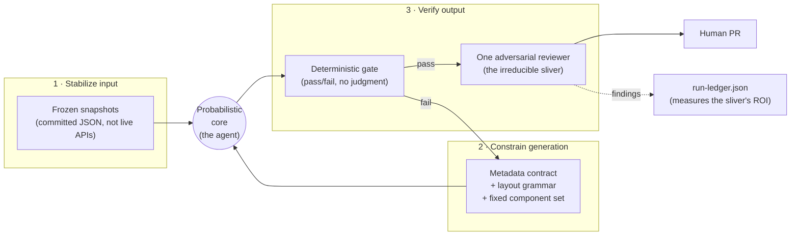

---
sources:
  - packages/components/component.schema.json
  - scripts/validate-metadata.js
  - docs/decisions/001-component-metadata-schema.md
  - docs/decisions/007-verified-component-loop.md
  - docs/decisions/008-behavioral-a11y-tier.md
  - docs/decisions/011-layout-landmark-grammar.md
---
# Taming non-determinism

## What it is

The same prompt run twice against the same model does not produce the same output — the wording drifts, and so can the decisions ([Deterministic vs. Probabilistic](08-glossary.md)). That is fine for drafting prose and fatal for a design system, where an agent that scaffolds a component or generates a page needs to land on a result a human can trust without re-checking every line. This system's answer is not to make the model deterministic — it can't — but to wrap the probabilistic core in deterministic structure at three points: **before** it generates (stabilize the input), **during** (constrain the decision space), and **after** (verify the output mechanically). What's left over — a thin band of genuinely ambiguous judgment — is the only place variance is allowed to reach a human, and even that band is measured rather than trusted.

The underlying principle, stated plainly in the [glossary](08-glossary.md), is that the deterministic gate "exists specifically to keep the parts that can be deterministic out of an agent's hands." Everything below is that principle applied at each of the three points.

| Move | Where it acts | What it removes | Owned by |
|---|---|---|---|
| Stabilize the input | Before generation | Run-to-run variance in *what the agent reads* | Frozen snapshots — [CLAUDE.md](../CLAUDE.md), `scripts/sense.js` |
| Constrain the generation | During generation | Freedom to invent structure, values, or components | [Metadata contract](10-machine-readable-metadata.md), [layout grammar](04-layout-grammar.md), fixed component set |
| Verify the output | After generation | Variance that slipped through, before it reaches `main` | [Deterministic gate](02-component-lifecycle.md) + [one adversarial reviewer](06-agentic-moments.md) |

## Why it's built this way

The naïve fix for "the agent gave a different answer this time" is to give it more context — more of the design system in the prompt, more examples, more rules. This system's standing principle is the opposite, and it is backed by a measured result rather than a preference: [ADR-013](decisions/013-cross-component-pattern-schema.md)'s pre-registered harness found that adding the cross-component pattern file to every generation task *helped* layout work but *worsened* component scaffolds — the larger aggregate crowded out the model's attention on the narrower rules a scaffold has to hit ([Self-improving loops](11-self-improving-loops.md)). Stability comes from **narrowing** what the model has to attend to, not widening it, and the amount of narrowing is calibrated by measurement per task, not maximized on faith.

The three moves also map onto a distinction Anthropic frames directly, quoted in [The numbers](case-study-source/08-measured-impact.md): tooling is "a contract between deterministic systems and non-deterministic agents." The script layer, the frozen snapshots, and the gate are the deterministic side of that contract; the agent is the non-deterministic side; the metadata and layout grammars are the interface between them. Naming the three moves as one strategy matters because each is documented elsewhere as a local fix — frozen snapshots as a cost saving, the metadata schema as a reuse contract, the gate as a quality bar — and the through-line that they are all the *same* move against the *same* problem is invisible until stated.

## How it works, concretely

### Move 1 — Stabilize the input

Every agentic moment reads the system's status quo from **committed files, never live APIs** ([CLAUDE.md](../CLAUDE.md)'s frozen-memory table; [Context engineering](09-context-engineering.md)). Governance state, token usage, Figma variables, component pipeline and review state, pattern aggregate, and pipeline status are each captured into a committed JSON artifact by a script (`scripts/sense.js`, `scripts/airtable-pull.js`, and siblings), and the agent reads the artifact. A committed read returns the identical bytes every time — within a session and across sessions — until the next `npm run sense` or governance pull deliberately refreshes it. A live Figma or Airtable call has none of those guarantees: it can return different data on a second call, fail on a rate limit, or hit an Enterprise-gated endpoint that isn't available on this plan at all (the Figma Variables REST API, [ADR-012](decisions/012-brand-layer-multi-brand.md); [Token pipeline](01-token-pipeline.md)). CLAUDE.md states the intent directly: the snapshots "shield agents from rate limits and keep each agent's context small."

The stabilizer even guards against manufacturing false variance in its *own* output: `sense.js`'s `writeIfChanged` blanks wall-clock-only fields before writing, so re-running with no real change produces zero diff rather than a new timestamp every day ([Self-improving loops](11-self-improving-loops.md)).

### Move 2 — Constrain the generation

The generation moments cannot invent freely; each is boxed by a machine-checkable contract.

- **Values are referenced, not authored.** Components consume built token output, never raw values, and a component's [metadata](10-machine-readable-metadata.md) `tokens.*` paths are *existence-checked* — `scripts/validate-metadata.js` merges every source token file into one tree and resolves each dot-path against a real `$value` node, so a token that was renamed or never existed fails the same PR that would ship it. The model cannot reach for a value outside the system.
- **Structure is locked before selection.** `/layout-generation`'s mandatory first pass is the [landmark grammar](04-layout-grammar.md) — a fixed Page → Header → Section → Container → Column → Component → Footer mapping, settled "before any component selection or spacing happens" ([ADR-011](decisions/011-layout-landmark-grammar.md)) and enforced by `npm run layout:validate`. Every structural choice must then *cite* a `composition.accepts`/`containedBy` or `usage.patterns` field — a graph the agent walks, not prose it interprets ([Machine-readable metadata](10-machine-readable-metadata.md)).
- **The component set is fixed, and expansion is gated.** New components come only from a canonical list ([CLAUDE.md](../CLAUDE.md)); [ADR-009](decisions/009-extend-vs-new-vs-internal.md)'s three-question test decides prop-vs-new-component-vs-internal-element, so "I'll just make a new one" is not a move the model gets to make unprompted.
- **The model is asked for its least creative behavior.** Every agentic moment wants low-temperature output — "writing a component or migrating a token usage should be as repeatable as possible, not creative" ([Temperature](08-glossary.md)).

### Move 3 — Verify the output

Whatever variance survives moves 1 and 2 is caught before it reaches human review. The [deterministic gate](08-glossary.md) — `npm run metadata:validate && npm run typecheck && npm run build && npm run a11y:coverage && npm run a11y:test`, plus `patterns:generate` staleness — is built entirely from *deterministic assertions*: exact, mechanical pass/fail checks with no judgment involved, run identically in the loop and in `components-check.yml` on every PR ([Component lifecycle](02-component-lifecycle.md)). If it fails, the loop bounces back to the scaffold stage rather than pushing the output forward ([ADR-007](decisions/007-verified-component-loop.md)). `layout:validate` plays the same role for layout files, and screenshot baselines ([ADR-019](decisions/019-screenshot-baseline-visual-regression.md)) add a perceptual diff so an unintended pixel shift is caught mechanically too.

## Where determinism ends — and why that's the point

Not everything can be reduced to a rule, and the system is explicit about the seam. The deterministic gate absorbs "the boring 90%" — validation, typecheck, build, three tiers of accessibility checking, contrast math — leaving the maintainer's judgment for "the sliver that's genuinely ambiguous: does this component's ARIA contract actually match its keyboard behavior, does this layout choice cite a real metadata relationship" ([Benefits by audience](case-study-source/02-benefits-by-audience.md)). That sliver is where the one fresh [adversarial reviewer](06-agentic-moments.md) works — a *probabilistic* check on the part no deterministic assertion can reach.

The honest move is that this last, irreducibly non-deterministic stage is itself measured rather than assumed worthwhile. `run-ledger.json`'s `reviewerFindingsBeyondGateCount` records exactly how many findings the reviewer caught that the gate could not, so "is the probabilistic stage worth its cost" is answered from receipts, not intuition ([Self-improving loops](11-self-improving-loops.md); [ADR-007](decisions/007-verified-component-loop.md)). And the receipts are read honestly: the ledger records post-pass runs only, so "12 of 12 runs passed the gate" is evidence that no failure survived to the record — not proof that gates never fail mid-loop ([The numbers](case-study-source/08-measured-impact.md)). The goal was never zero non-determinism. It was to push the probabilistic surface down to the smallest band that genuinely needs judgment, wrap the rest in structure that behaves the same way every time, and measure whether that last band earns its keep.

## Diagram

## Related

- Docs: [Context engineering](09-context-engineering.md), [Machine-readable metadata](10-machine-readable-metadata.md), [Layout grammar](04-layout-grammar.md), [Component lifecycle](02-component-lifecycle.md), [Self-improving loops](11-self-improving-loops.md), [Agentic moments](06-agentic-moments.md), [Glossary](08-glossary.md)
- ADRs: [001 — Component metadata schema](decisions/001-component-metadata-schema.md), [007 — Verified component loop](decisions/007-verified-component-loop.md), [008 — Behavioral a11y tier](decisions/008-behavioral-a11y-tier.md), [009 — Extend vs new vs internal](decisions/009-extend-vs-new-vs-internal.md), [011 — Layout landmark grammar](decisions/011-layout-landmark-grammar.md), [013 — Cross-component pattern schema](decisions/013-cross-component-pattern-schema.md)
- Scripts: `npm run sense`, `npm run metadata:validate`, `npm run layout:validate` — see the [CLI reference](07-cli-reference.md)
- Case study: [Automation vs. agents](case-study-source/03-automation-vs-agents.md), [The metadata contract](case-study-source/06-machine-readable-contract.md), [The numbers](case-study-source/08-measured-impact.md)
