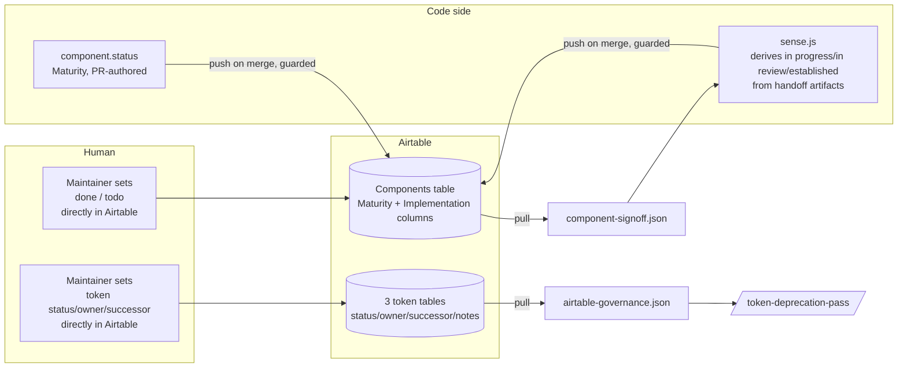

# Airtable governance flow, both directions

*Case-study source draft — narrative voice, for `docs/system-case-study.html`. Not yet linked from the docsify sidebar.*

## The problem with one column doing two jobs

Early on, the Airtable Components table had a single `Status` field, and its options quietly mixed two unrelated questions: *is this component production-ready* (`beta` / `ready` / `deprecated`) and *where is it in the pipeline* (`todo` / `in progress` / `in review`). One field, two axes, and the collision showed up immediately in practice. `Select` had been through a full adversarial review — `.review.json` written, the gate green, `.learnings.json` filed — and `STATUS_QUO.md` still showed nothing but `ready`. The review had happened and was invisible. `Accordion` was the opposite kind of contradiction: `beta` by maturity, but the maintainer considered its implementation finished. No single field can hold both of those facts at once.

That's the failure ADR-010 fixes, and it's worth walking through because the fix generalizes into the rule that governs *every* Airtable interaction in this system: **never let a human-owned value and a code-owned value share a column.**

## Two axes, two owners, two directions

The resolution splits component lifecycle into Maturity and Implementation, and — this is the part that matters for governance — assigns each value in each axis to exactly one owner, moving in exactly one direction:

| Value | Axis | Owner | Direction |
|---|---|---|---|
| `beta` / `ready` / `deprecated` | Maturity | Code (`component.status` in metadata) | Code → Airtable, pushed on merge |
| `in progress` / `in review` / `established` | Implementation | Code, derived by `sense.js` from handoff artifacts | Code → Airtable, pushed on merge |
| `done` / `todo` | Implementation | Human, set directly in Airtable | Airtable → code, pulled |

Token governance follows the identical shape, one layer up: `status` (`active`/`deprecated`), `owner`, `successor`, and `notes` are authored by a human in Airtable and pulled into `airtable-governance.json` — never pushed from code, because a deprecation decision is a judgment call, not a derived fact.

Put the two examples side by side and the pattern is obvious: **whichever side has the human judgment is the side that writes to Airtable directly; the other side reads it back.** Code never proposes a deprecation. A human never hand-writes a component's derived pipeline stage. The direction of data flow *is* the org chart for who's allowed to decide what.

## Why "push everything, let the last write win" doesn't work here

The naive alternative — sync in both directions, whoever writes last wins — was never on the table, and the reason is mechanical, not philosophical. `airtable-sync.js` performs a **partial upsert**: it writes only the fields it's given and never clears a field it omits. That sounds safe (nothing gets nuked), but it has a sharp edge: if a pushed field and a human-edited field are the same column, the human's edit survives right up until the next sync, and then silently reverts to whatever code last pushed. A maintainer could mark `Implementation: done` in Airtable, feel good about it, and watch it get overwritten by `in review` on the next merge — with no error, no warning, just a quietly wrong value.

The fix isn't "sync more carefully." It's the same-column rule above, backed by two explicit guards in `airtable-sync.js` (`HUMAN_OWNED_IMPL = new Set(["done", "todo"])`):

1. **Never overwrite a human value.** Before writing `Implementation`, `push:components` reads what's already in Airtable and skips the write entirely if it's already `done` or `todo`. Combined with the partial-upsert behavior, a human value is now doubly protected — the sync won't touch the cell, and even if it did, omission wouldn't clear it.
2. **Never orphan a human value.** The sync also deletes Airtable rows whose code-side counterpart no longer exists (an "orphan" cleanup) — necessary so deleted components don't linger as ghost rows forever. But a `todo` row might represent a component that's *planned* and doesn't have code yet on purpose. `done`/`todo` rows are explicitly exempted from orphan deletion, so a maintainer can queue a future component in Airtable without a sync run silently deleting the placeholder.

Neither guard is a policy someone has to remember to follow during a PR. Both are `if` statements in `scripts/airtable-sync.js` that run on every merge.

## The pull side: why "read Airtable" never means a live call

Every consumer of governance state in this system — `/token-deprecation-pass`, `sense.js`, the frozen-memory table in `CLAUDE.md` — reads a committed JSON file, never the Airtable API directly, and never the Airtable MCP. That's a deliberate rule, not an oversight: `scripts/airtable-pull.js` is the *only* thing that talks to Airtable on the read side, and it writes what it finds into two frozen snapshots:

- `packages/tokens/airtable-governance.json` — per-token `status`/`owner`/`successor`/`notes`
- `.claude/component-signoff.json` — per-component human `done`/`todo`

Everything downstream treats these as the state of the world until the next `npm run airtable:pull:governance`. This buys the same thing frozen snapshots buy everywhere else in the system (Figma variables, token usage, component patterns): agents doing deprecation passes or sensing pipeline stage don't make a live network call mid-task, don't get rate-limited by Airtable, and operate on a small, predictable, versionable file instead of an API response that could change out from under them between one tool call and the next.

The trade-off is explicit, not hidden: `done` accuracy depends on a human remembering to pull, or on the scheduled pull Action (still open — see the frozen-memory table). `sense.js` could in principle flag drift — Airtable says `done` while the derived stage has since regressed — but doesn't today. That's a known gap, not a silent one.

## The full loop, concretely

The guard sits at exactly one point — the write into the shared `Implementation` column — because that's the only place code and human values could otherwise collide. Everywhere else on the diagram, ownership is already unambiguous by construction: a token table's governance columns are never written by code at all, and a component's Maturity column is never written by a human at all.

## Why this is a governance story, not just a sync-script story

The reason this belongs in a case study and not just a scripts reference is what it demonstrates about the system's design instinct more broadly: **when two processes could write the same fact, the fix is never "coordinate more carefully" — it's "split the fact into two facts, each with one writer."** The same move recurs in how ADRs themselves are governed (amend in place, supersede rather than overwrite, so a wrong decision and its correction both stay on the record) and in how the token layers are structured (primitives → brand → theme → device, each layer only able to override, never mutate, the one before). Airtable governance is the sharpest, most operational example of that instinct, because it's the one place a silent overwrite would have cost a real person real trust in the system — a maintainer who marks something `done` and later finds it quietly reverted would stop trusting the sign-off column, and a governance layer nobody trusts isn't a governance layer.

## Sources for this section

- `docs/05-governance.md`
- `docs/decisions/010-component-lifecycle-two-axes.md`
- `docs/decisions/002-three-layer-token-model.md`
- `scripts/airtable-sync.js`, `scripts/airtable-pull.js`
- `.claude/commands/airtable-sync.md`, `.claude/commands/token-deprecation-pass.md`
- `packages/tokens/airtable-governance.json`, `.claude/component-signoff.json`
